# Running SCBench with Newer Models

September 28, 2026

We ran seven coding models through `circuit_eval`, `database_migration`, and `dynamic_config_service_api`: 17 checkpoints that reveal new requirements one at a time. Each model inherited its own code but started a fresh conversation at every checkpoint. All used medium effort, with no reviewer or fixer. We measured correctness, token costs, and how code quality changed as the programs grew.

Astra 6 led on strict correctness at 11/17 checkpoints. Sonnet 5.5 matched Opus 5.5 at 7/17 for about one third of the API-equivalent cost, while Sol 6 had the lowest recorded cost. Quality metrics told a different story: Opus 5 had the lowest measured erosion despite weak correctness. Fable 5.1 finished at 3/17 and $69.84, with no timeout or recovery, but two denied package installs qualify its result. These are preliminary results from one run per model, with disclosed harness recoveries—not a definitive model ranking. The dollar figures estimate API prices for runs made through subscriptions.

**Astra 6 is the only model among the 7 completed baselines to fully pass a problem: `circuit_eval`, with all 8 checkpoints strictly passing.** A fully passed problem requires every checkpoint to pass all collected tests, including required regressions, with no failures or skips.

## Scores and cost

| Model | `circuit_eval` /8 | `database_migration` /5 | `dynamic_config_service_api` /4 | Strict total | Partial pass | API-equivalent cost | Session time |
|---|---:|---:|---:|---:|---:|---:|---:|
| Sonnet 5.5 | 6 | 1 | 0 | 7/17 | 90.8% | $6.86 | 42.8 min |
| Opus 5.5 | 6 | 1 | 0 | 7/17 | 90.7% | $21.07 | 80.0 min |
| Sol 6 | 3 | 1 | 1 | 5/17 | 90.3% | ≥$4.03 | 61.7 min |
| Astra 6 | 8 | 1 | 2 | 11/17 | 90.8% | ≥$15.89 | 77.7 min |
| Fable 5.1 | 2 | 1 | 0 | 3/17 | 85.1% | $69.84 | 149.0 min |
| Opus 5 | 2 | 1 | 1 | 4/17 | 85.8% | $72.85 | 195.6 min |
| Sol 5.6 | 6 | 1 | 1 | 8/17 | 90.6% | ≥$13.29 | 98.5 min |

Partial pass is the arithmetic mean of each checkpoint’s passed/collected fraction, with equal checkpoint weights. Skipped tests remain in the collected denominator to match recorded fractions. Checkpoints are correlated and often repeat regression tests; they are not 17 independent tasks.

Costs include failed attempts and deduplicate native session IDs across original, recovered, and resumed receipts. They are API price equivalents, not subscription cash charges. One interrupted `database_migration` attempt per Codex model lacks usage, so those costs are lower bounds. In-progress calls are excluded until a receipt is available. Sonnet 5.5 is repriced from provider usage because the pinned CLI reports an incorrect price. Session time excludes grading and is affected by concurrent execution. No execution-budget timeouts have occurred.

| Model | Input, including cache | Cached input | Output |
|---|---:|---:|---:|
| Sonnet 5.5 | 4.7M | 4.1M | 348K |
| Opus 5.5 | 12.7M | 11.7M | 525K |
| Sol 6 | 7.3M | 6.7M | 150K |
| Astra 6 | 3.9M | 3.3M | 133K |
| Fable 5.1 | 20.8M | 19.4M | 742K |
| Opus 5 | 69.6M | 68.0M | 910K |
| Sol 5.6 | 13.2M | 12.4M | 268K |

## At a glance

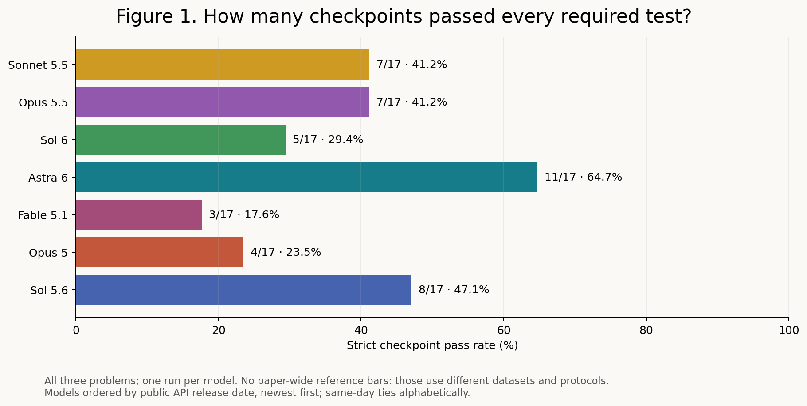

**Figure 1. Strict checkpoint pass rates.**

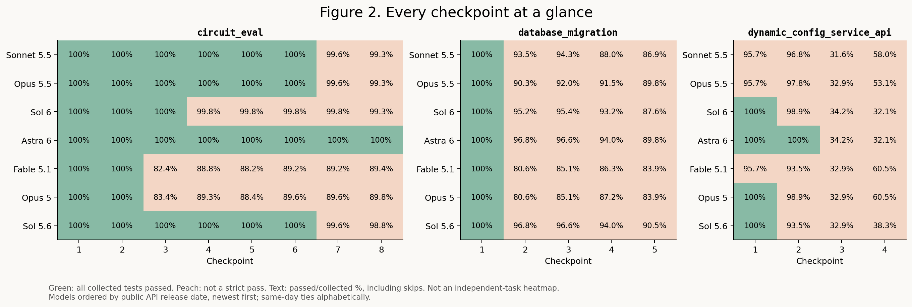

**Figure 2. All checkpoint results.**

## How failures accumulate

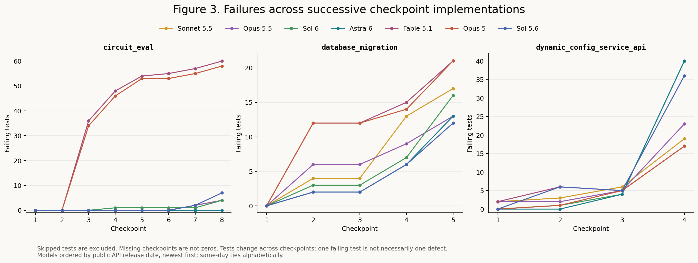

**Figure 3. Failing tests by checkpoint.**

These charts follow the questions in [Dex Horthy’s write-up](https://github.com/humanlayer/advanced-context-engineering-for-coding-agents/blob/main/benchmarking-opus-5-on-slop-code-bench.md), using our own measurements. Failing tests are not necessarily distinct defects. Skips are excluded from failure counts. `dynamic_config_service_api` checkpoints 3–4 intentionally exclude prior tests, so changes in these curves do not by themselves establish regressions.

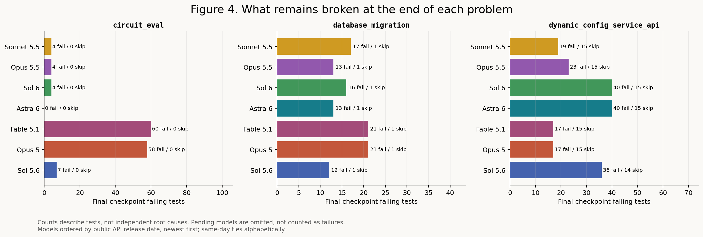

**Figure 4. Final-checkpoint failures by problem.**

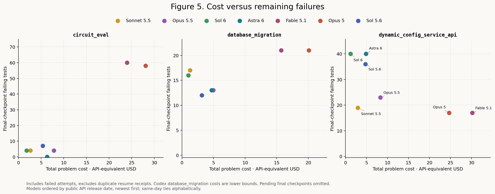

**Figure 5. Problem cost versus final-checkpoint failures.**

## Published external comparisons

Figures 6–7 add Dexter’s Opus 4.8, Sonnet 5 and Opus 5 results, with separate study labels and chronological model ordering. Totals cover only the same three problems and sum their final failing-test counts once. These are descriptive cross-study comparisons: Dexter’s exact test collections, effort and skipped-test counts are unavailable. Failing tests are not necessarily distinct defects.

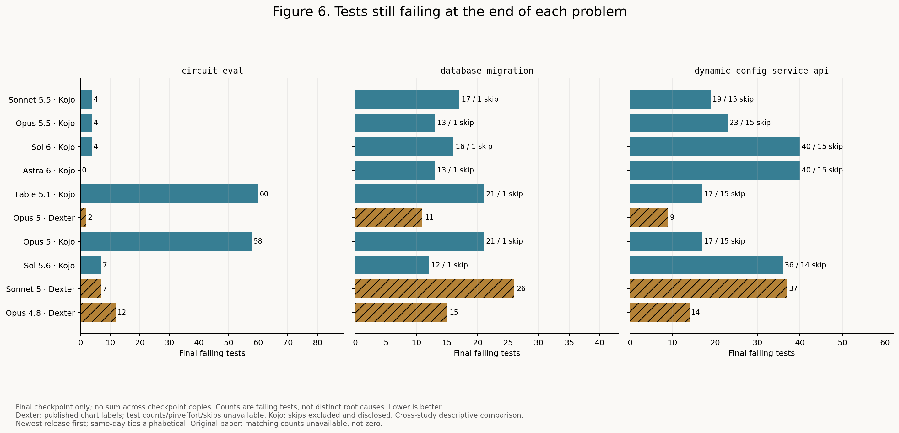

**Figure 6. Final failing tests per problem, model and study.**

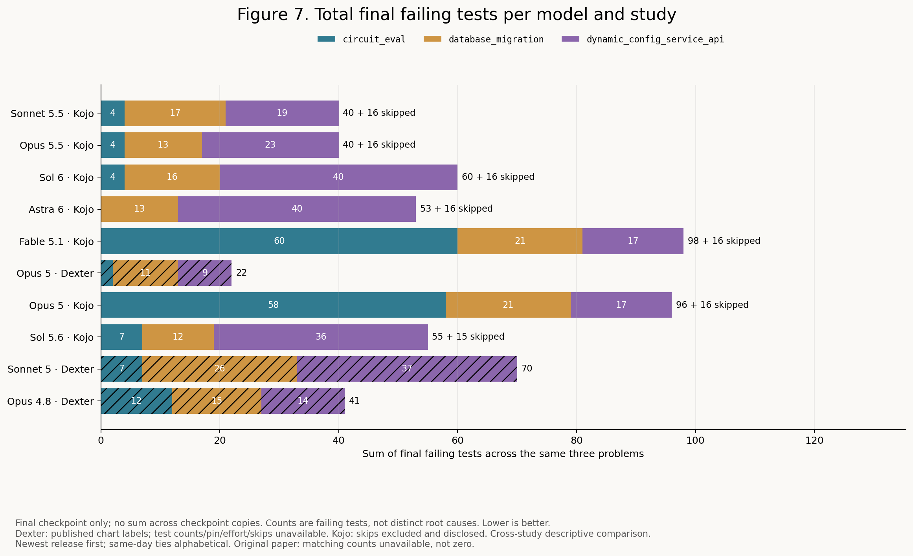

**Figure 7. Total final failing tests across the three problems.**

The original SCB paper does not supply matching final failing-test counts in its reported tables; its aggregate solve percentages cannot be converted into these counts. Its 11 models and published strict rates are included separately in the [external comparison and source notes](EXTERNAL_DEFECT_COMPARISON.md), with defect counts marked unavailable. Missing counts are not plotted as zero.

## Partial-pass value versus model release date

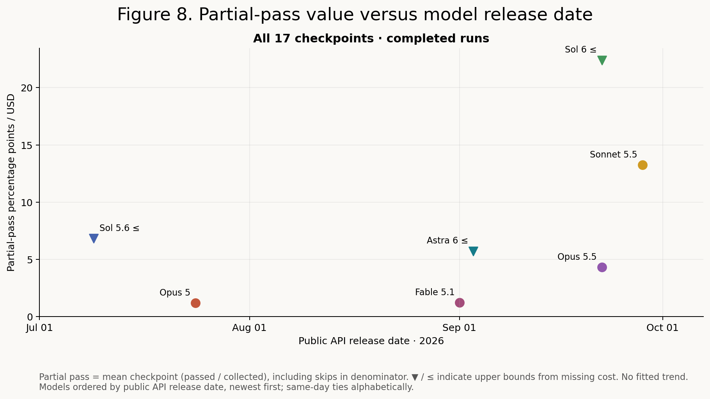

**Figure 8. Partial-pass value versus model release date.**

**Metric:** mean checkpoint pass percentage ÷ total cost for the same selected checkpoints. Units are percentage points per dollar, not additional successes caused by spending. All seven completed models are compared on all 17 checkpoints. The earlier 13-checkpoint view covered only `circuit_eval` and `database_migration` while two API runs were unfinished; it has been removed now that all runs are complete. Missing cost makes the ratio an **upper bound**, shown with ≤ / downward triangles.

The x-axis uses the provider-documented public API release date as the operational definition of general availability. It is not a preview date, training cutoff, or snapshot date. This is a cross-sectional comparison, with no trend line or claim that release date causes better value.

| Model | Public API release | Full-suite partial pass / $ |
|---|---|---:|
| Sonnet 5.5 | [2026-09-28](https://platform.claude.com/docs/en/release-notes/overview#september-28-2026) | 13.24 |
| Opus 5.5 | [2026-09-22](https://platform.claude.com/docs/en/release-notes/overview#september-22-2026) | 4.31 |
| Sol 6 | [2026-09-22](https://developers.openai.com/api/docs/changelog#september-2026) | ≤22.40 |
| Astra 6 | [2026-09-03](https://developers.openai.com/api/docs/changelog#september-2026) | ≤5.71 |
| Fable 5.1 | [2026-09-01](https://platform.claude.com/docs/en/models/fable-5-1/overview) | 1.22 |
| Opus 5 | [2026-07-24](https://www.anthropic.com/news/claude-opus-5) | 1.18 |
| Sol 5.6 | [2026-07-09](https://developers.openai.com/api/docs/changelog#july-2026) | ≤6.82 |

Dates were verified from the [OpenAI API changelog](https://developers.openai.com/api/docs/changelog), [Claude Platform release notes](https://platform.claude.com/docs/en/release-notes/overview), and the [Opus 5 announcement](https://www.anthropic.com/news/claude-opus-5). Exact dates and source links are recorded in `model_release_dates.json`. Scores use benchmark-time pricing, not historical launch pricing.

## Checkpoint breakdown

Cells are passed/collected. Collected includes skipped tests. “Pending” means not yet graded.

### `circuit_eval`

| Checkpoint | Sonnet 5.5 | Opus 5.5 | Sol 6 | Astra 6 | Fable 5.1 | Opus 5 | Sol 5.6 |
|---|---:|---:|---:|---:|---:|---:|---:|
| 1 | 36/36 | 36/36 | 36/36 | 36/36 | 36/36 | 36/36 | 36/36 |
| 2 | 99/99 | 99/99 | 99/99 | 99/99 | 99/99 | 99/99 | 99/99 |
| 3 | 205/205 | 205/205 | 205/205 | 205/205 | 169/205 | 171/205 | 205/205 |
| 4 | 430/430 | 430/430 | 429/430 | 430/430 | 382/430 | 384/430 | 430/430 |
| 5 | 457/457 | 457/457 | 456/457 | 457/457 | 403/457 | 404/457 | 457/457 |
| 6 | 508/508 | 508/508 | 507/508 | 508/508 | 453/508 | 455/508 | 508/508 |
| 7 | 527/529 | 527/529 | 528/529 | 529/529 | 472/529 | 474/529 | 527/529 |
| 8 | 562/566 | 562/566 | 562/566 | 566/566 | 506/566 | 508/566 | 559/566 |

### `database_migration`

| Checkpoint | Sonnet 5.5 | Opus 5.5 | Sol 6 | Astra 6 | Fable 5.1 | Opus 5 | Sol 5.6 |
|---|---:|---:|---:|---:|---:|---:|---:|
| 1 | 39/39 | 39/39 | 39/39 | 39/39 | 39/39 | 39/39 | 39/39 |
| 2 | 58/62 | 56/62 | 59/62 | 60/62 | 50/62 | 50/62 | 60/62 |
| 3 | 82/87 | 80/87 | 83/87 | 84/87 | 74/87 | 74/87 | 84/87 |
| 4 | 103/117 | 107/117 | 109/117 | 110/117 | 101/117 | 102/117 | 110/117 |
| 5 | 119/137 | 123/137 | 120/137 | 123/137 | 115/137 | 115/137 | 124/137 |

### `dynamic_config_service_api`

| Checkpoint | Sonnet 5.5 | Opus 5.5 | Sol 6 | Astra 6 | Fable 5.1 | Opus 5 | Sol 5.6 |
|---|---:|---:|---:|---:|---:|---:|---:|
| 1 | 45/47 | 45/47 | 47/47 | 47/47 | 45/47 | 47/47 | 47/47 |
| 2 | 90/93 | 91/93 | 92/93 | 93/93 | 87/93 | 92/93 | 87/93 |
| 3 | 24/76 | 25/76 | 26/76 | 26/76 | 25/76 | 25/76 | 25/76 |
| 4 | 47/81 | 43/81 | 26/81 | 26/81 | 49/81 | 49/81 | 31/81 |

## Interpretation

- `circuit_eval`: Astra is the only model to pass all eight checkpoints. Opus 5.5 and Sonnet 5.5 have identical test outcomes. Sol 6 loses three checkpoints through a persistent width-one vector bug despite passing over 99% of those tests. Opus 5 introduces reserved-name/comparator regressions at checkpoint 3. Later optimization and export failures separate the otherwise strong models. See [source-level analysis](CIRCUIT_ANALYSIS.md).
- `database_migration`: the original six models pass all 25 new checkpoint 3 tests, but inherited checkpoint 2 failures keep strict scores low. Astra and Sol 5.6 match through checkpoint 4; Sol 5.6 wins one additional checkpoint 5 validation-path test. Failures include event schemas, transformations, rollback metadata and dependency handling. Some test expectations contradict or exceed the prose specification; see [detailed analysis](MIGRATION_ANALYSIS.md). Each checkpoint 3–5 collection has one skip: an older test explicitly applies only to checkpoints 1–2, regardless of model behavior.
- `dynamic_config_service_api`: among the original four completed models, checkpoint 3 has 46 skips each. Astra’s 26/76 is 26 passed, four failed and 46 skipped—not 50 failures. The upstream helper conditionally skips first-proposal requests when no valid active version exists, because the specification leaves the bootstrap sentinel undefined. Other helpers skip when a required proposal is absent. These are state-dependent prerequisites, not a blanket rule that a failed test skips everything after it; earlier failures or skips can leave later tests without the required state. Some subsequent checks still fail rather than skip. Checkpoint 4 has 15 skips for Opus 5, Astra and Sol 6, and 14 for Sol 5.6. Opus 5 leads those four on checkpoint 4 with 49 passes. Opus 5.5 finishes checkpoint 4 at 43/81 (23 failures, 15 skips); Sonnet 5.5 reaches 47/81 (19 failures, 15 skips). Both fail all four strict checkpoints. Their checkpoint 3 results are 25/76 and 24/76, respectively, with 46 skips each.
- Fable 5.1: `circuit_eval` passes only checkpoints 1–2; `database_migration` passes only checkpoint 1. It fully passes no `dynamic_config_service_api` checkpoint. All 17 sessions completed within the 30-minute limit. Fable has the lowest strict score and costs more than the five baselines with higher strict scores other than Opus 5. Two denied dependency-install attempts qualify the comparison; see the execution limitation below.

## Code quality across all three problems

All 119 checkpoint snapshots now have static quality analysis. The [complete quality report](quality-suite/QUALITY.md) includes coverage, source verification, precise metric definitions, all chart data, and a disclosed fix for Unicode line separators in the pinned analyzer. No model calls were needed.

Across the three final snapshots, Opus 5 leaves 21.8K Python SLOC versus Sol 6’s 3.8K. Opus 5 has the lowest mean final erosion (0.455) despite weak strict correctness. Astra has the lowest all-Python verbosity (0.252), but excluding test-named files raises that to 0.366. These metrics describe code structure; they do not prove maintainability or correctness.

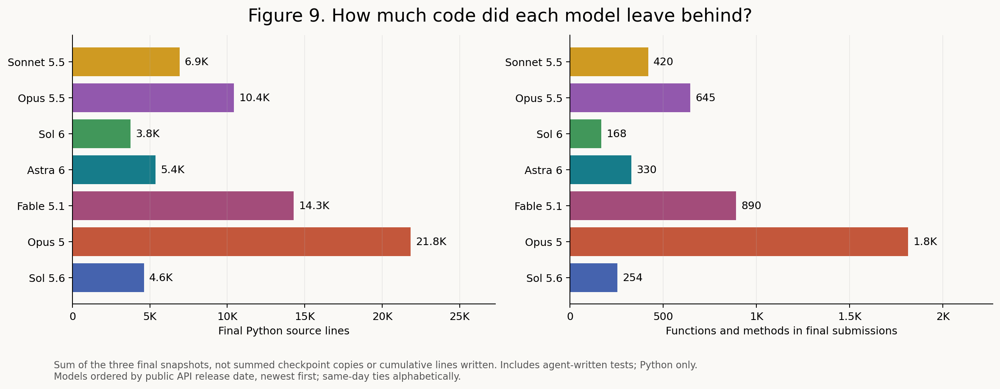

**Figure 9. Final source volume and function counts.**

Figure 9 counts Python function and method definitions in each final submission, summed across the three problems. These are definitions, not runtime calls. Generated tests are included; earlier checkpoint copies are not counted again.

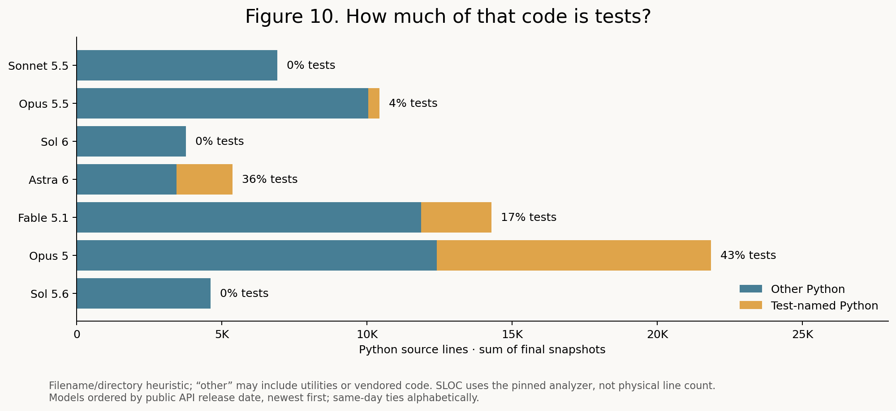

**Figure 10. Test-named versus other Python code.**

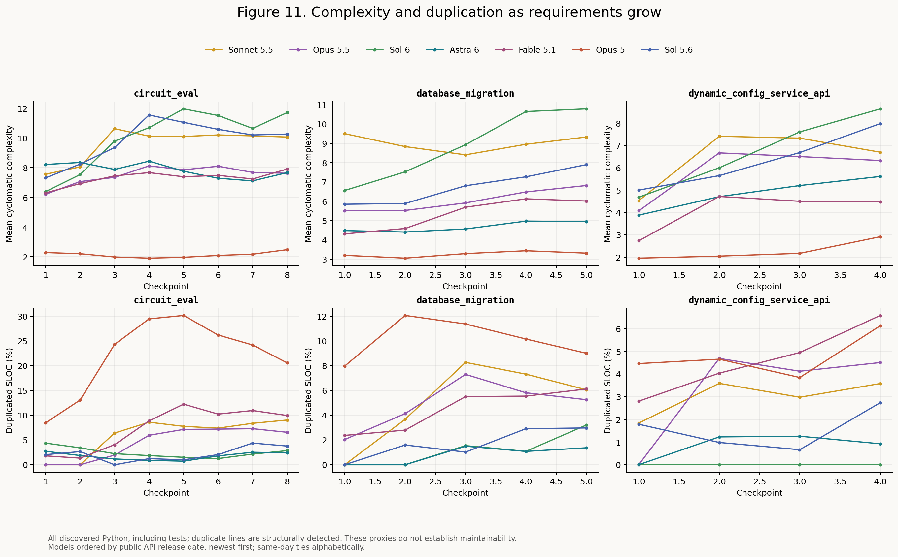

**Figure 11. Complexity and duplication trajectories.**

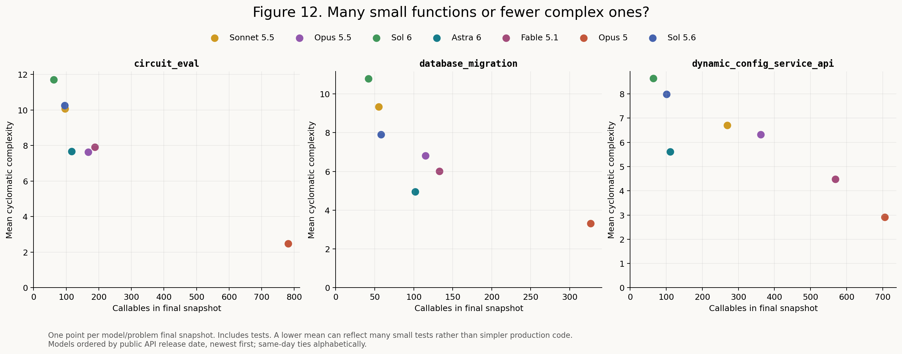

**Figure 12. Function count versus mean complexity.**

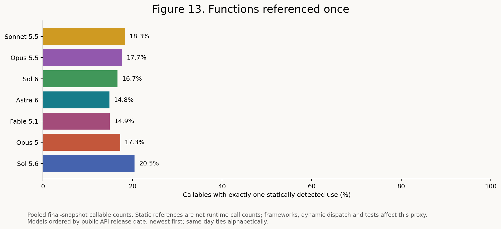

**Figure 13. Functions referenced once.**

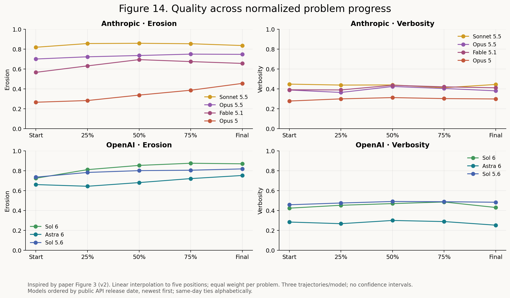

**Figure 14. Paper-style erosion and verbosity across normalized progress.**

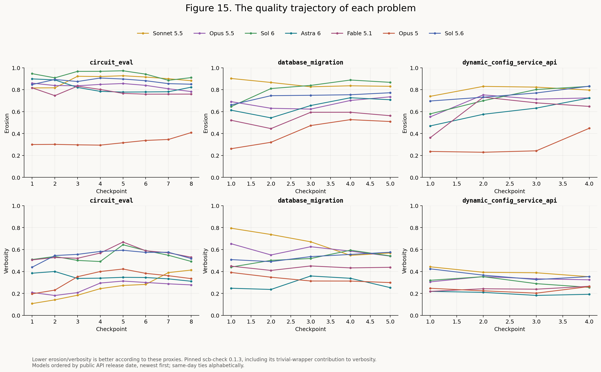

**Figure 15. Erosion and verbosity by problem.**

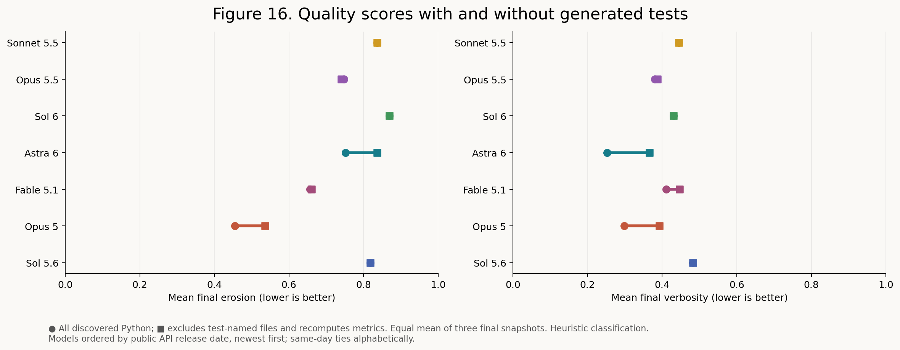

**Figure 16. Quality scores with and without generated tests.**

In Figure 16, each row is one model. The circle is its score with all discovered Python; the square is its score after removing test-named files and rerunning the analyzer. The connecting line shows how much including tests changes the measurement, not improvement over time. Both axes run from 0 to 1; lower is better according to these proxies. Each point averages the three final problem snapshots equally. For example, Astra’s verbosity changes from 0.252 with tests to 0.366 without them. Test detection uses filenames, so this is an approximate separation.

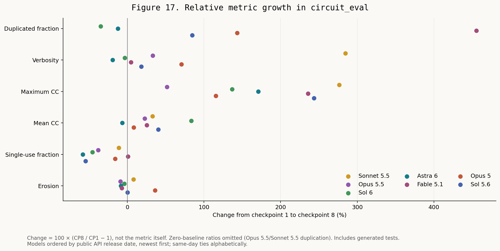

**Figure 17. Relative metric growth in circuit_eval.**

Figure 17 compares checkpoint 8 with checkpoint 1 for each model using `100 × (final / initial − 1)`. The percentages are changes, not quality scores or percentage-point differences. For Sonnet 5.5, maximum cyclomatic complexity grows from 34 to 128 (+276.5%), and verbosity from 0.107 to 0.413 (+284.7%). These calculations are correct, but a small starting value can produce a large percentage. Opus 5.5 and Sonnet 5.5 start with zero detected duplication; their duplication ratios are undefined and omitted, even though their final duplication is 6.55% and 9.03%. The plot includes generated tests and growing requirements; it does not establish an overall quality ranking.

The quality plots use scb-check 0.1.3 with a recorded physical-line handling fix. Figure 14 is inspired by Figure 3 of [SlopCodeBench v2](https://arxiv.org/pdf/2603.24755v2), using our own three-problem trajectories. Human-repository and alternative-prompt comparisons are absent because we did not collect those experiments. Full details are in the quality report.

## Protocol and limitations

Stock system prompts; medium effort; default output limits; no review; memory/installed skills disabled; network enabled; current checkpoint spec only; fresh conversations with source carried forward. Problems ran sequentially and the original models ran in parallel within each problem. Sonnet’s initial problem and all Fable problems ran separately; their timings are not concurrency-matched. Native macOS execution replaces Docker. The checkpoint limit is 30 minutes. No skill-learning intervention is being evaluated here, so no learning-cost break-even estimate is justified.

We did not create a GitHub fork of SCB. Kojo is a separate local harness around pinned upstream SCB repositories; the runner checkout still points to `SprocketLab/slop-code-bench` and is unmodified. We adapted the execution layer to invoke subscription-authenticated Codex CLI and Claude Code instead of direct, per-token API calls, and to run in isolated local directories on macOS instead of Docker. We reuse the pinned upstream problem specifications and grading tests, including checkpoint-specific regression settings. Our local integration also handles Python/shell/package entrypoints, transcript capture and checkpoint recovery; those deviations are disclosed below. This is an SCB-based experiment with a custom execution harness, not an unchanged run of the published setup.

The dollar figures are hypothetical API-equivalent costs calculated from token usage and published rates. They are not API invoices, incremental subscription charges, or an allocation of the monthly subscription fee. Actual execution consumes the existing subscriptions’ usage allowances; subscription quota readings are separate telemetry.

Pinned problems: `38d627ecf668a88f88f8d260f8df8df6116e9b03`; runner: `31ceea3add480edb33431e70475c4c70597e6b31`; Claude CLI `2.1.283`; Codex CLI `0.158.0`; Python `3.12.8`.

Recovery is a material protocol qualification. `database_migration` resumed verified snapshots after provider/telemetry failures, rebuilding environments from requirements. Astra submitted a shell-script wrapper that launches its Python implementation of `dynamic_config_service_api`. Our original grader incorrectly tried to interpret that wrapper as Python, producing invocation failures. We regraded the unchanged submissions with a launcher that detects and supports Python, sh and bash entrypoints. Source hashes and test collections were verified unchanged; no model rerun or solution edit was involved. The corrected scores are 47/47, 93/93, 26/76 and 26/81 for checkpoints 1–4. The original invalid grades are preserved, and the corrected grades are used throughout this report. Opus 5.5/Sonnet 5.5 transcripts were valid JSONL: `splitlines()` incorrectly split Unicode separators inside strings. LF-only framing fixed verification without altering transcript bytes. Their checkpoint 2 outputs were frozen after the event from terminal workspaces, with matching session IDs and source mtimes preceding final receipts. Python directory entrypoints now run as modules. Original evidence is preserved; see [recovery receipts](API_RECOVERY.md).

All 119 accepted checkpoints passed frozen-source hash, source-handoff, native-transcript hash, exact-prompt receipt and configured model/effort receipt checks. The automated external-access audit parsed all 119 transcripts with zero errors and flagged no benchmark-targeted access. It selected 99 candidate actions; the additional 20 actions come from Fable. Its search-like matches are local code writes, and observed HTTP probes target localhost. Two attempts to install jsonschema and PyYAML during `dynamic_config_service_api` checkpoint 2 were denied by Claude Code’s unattended permissions; Fable then wrote local validator/parser implementations. Network was enabled in configuration, but this is evidence that dependency installation was not unrestricted. This execution limitation may affect correctness, effort and cost; we have not rerun it or attributed particular test failures to it. Counts and classifications are retained in `suite_verification.json`. Manual inspection of the original six models’ three search-like matches found two local JSON-schema code writes and one localhost test, not web searches. Other observed actions include localhost testing and a Sol 6 download of the Open Policy Agent binary from openpolicyagent.org. URLs in code are not proof of a fetch. Full results and flagged external-source actions are saved in `suite_verification.json`. This remains a heuristic tool-action audit, not complete network egress monitoring or a manual review of every transcript. Do not treat it as proof of no contamination.

Horthy reported Opus 5 at 4/17 on this named subset. Ours also scores 4/17, but on different checkpoints: ours `circuit_eval` 1–2, `database_migration` 1, `dynamic_config_service_api` 1; his `circuit_eval` 1–3 and `database_migration` 1. His effort and exact dataset pin are unspecified in the fetched write-up. Equal totals do not constitute an exact replication. One trajectory per model and three problems are preliminary evidence, not a statistically established universal ranking.

## Run the experiment yourself

Software dependencies: macOS, Git, uv, Python 3, and Node.js/npm. Setup installs Python 3.12.8, Codex CLI 0.158.0, Claude Code 2.1.283, and the pinned benchmark dependencies. Authenticated provider accounts with access to the selected models are required. No Docker or tmux is needed.

**Account risk:** Anthropic may suspend or terminate accounts for terms violations. Its consumer terms restrict automated access except where explicitly permitted. Kojo invokes the official Claude Code CLI, but that is not a guarantee that this benchmark workload is permitted under your subscription. Review the [Consumer Terms](https://www.anthropic.com/legal/consumer-terms) and [Claude Code usage rules](https://code.claude.com/docs/en/legal-and-compliance) before running it. See Anthropic’s [enforcement policy](https://www.anthropic.com/transparency/system-trust-reporting).

```sh
sh scripts/scb_setup.sh
```

Preview, check the native harness without inference, then launch the experiment:

```sh
.venv/bin/python scripts/scb_suite.py --id repro-01 --models sonnet55 opus55 sol6 astra6 fable51 opus5 sol56
.venv/bin/python scripts/scb_suite.py --id repro-01 --models sonnet55 opus55 sol6 astra6 fable51 opus5 sol56 --audit
.venv/bin/python scripts/scb_suite.py --id repro-01 --models sonnet55 opus55 sol6 astra6 fable51 opus5 sol56 --run
```

Select models with a space-separated list:

```sh
.venv/bin/python scripts/scb_suite.py --id repro-02 --models sonnet55 opus55 astra6 --run
```

Supported suite aliases map to exact provider IDs; they are not moving “latest” aliases:

| CLI alias | Provider model ID |
|---|---|
| `sonnet55` | `claude-sonnet-5-5` |
| `opus55` | `claude-opus-5-5` |
| `sol6` | `gpt-6-sol` |
| `astra6` | `gpt-6-astra` |
| `opus5` | `claude-opus-5` |
| `sol56` | `gpt-5.6-sol` |
| `fable51` | `claude-fable-5-1` |

`--models` is required; no models are selected implicitly. Duplicate models are rejected. Use the same selection for audit and run.


Use a new ID for each experiment. Use `--models sonnet55` for one model. The example selects seven models, medium effort, no review, default output limits and 30-minute sessions: 119 sessions across the three problems. Models run in parallel within each problem; problems and each model’s checkpoints run sequentially. `--run` consumes provider allowance with usage reporting but no spending cap. Required model access remains account-dependent.

Progress prints in the terminal; Ctrl-C stops the controller. Grades and submissions go to `results/runs/<run-id>/`; transcripts and logs go to `intermediate/runs/<run-id>/`. Both stay local. New stochastic runs need not match our scores or historical interruptions. Our raw run evidence is not included in this repository.

---

Jeremy Hale · [@jemdiggity](https://github.com/jemdiggity) · [kanna.build](https://kanna.build)
